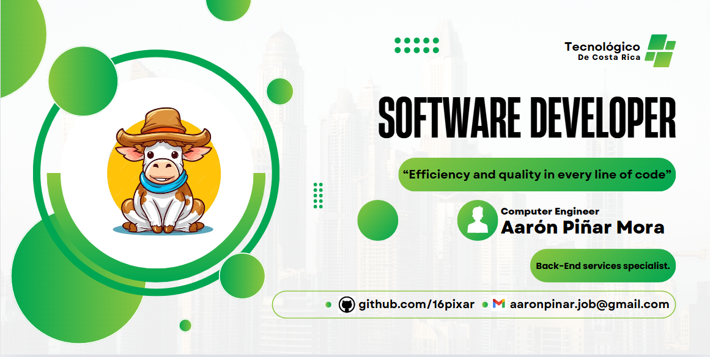
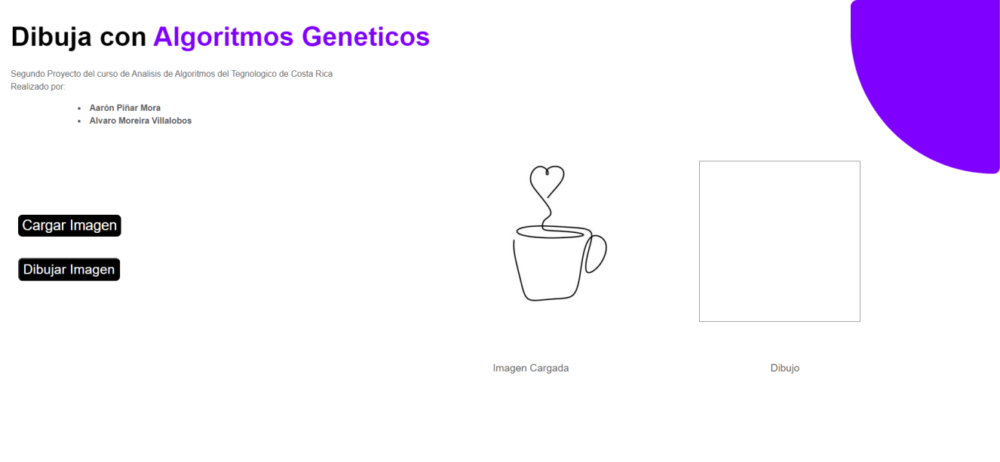
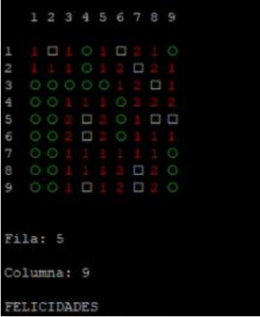

<h1 align="center"> Hi, I'm Aarón</picture></h1> 

 

### <b>⚙️ &nbsp;GitHub Analytics</b> 

  

  

<!--<https://devicon.dev>-->
<h2> 👨🏻‍💻 Languages  </h2>
<table align ="center">
  <tr>  
    <td></td>
    <td></td>
    <td></td> 
    <td></td>
  </tr>
    <tr >
    <td></td>
    <td></td>  
    <td></td>
    <td></td>
  </tr>
  <tr>
    <td></td>
    <td></td>
    <td></td>
  </tr>
</table>

<h2> ✍🏻 &nbsp;Some Tools and Libraries I Have Used and Learned</h2>
<table align ="center">
  <tr>
    <td></td>
    <td></td>
    <td></td>
    <td></td>
    <td></td>
  </tr>
  <tr>
    <td></td>
    <td></td>
    <td></td>
    <td></td>
    <td></td>
  </tr>
  <tr>
    <td></td>
    <td></td>
  </tr>
</table>

## 🔨Projects

<table>
<tr>
  <td width="50%">
    <h3 align="center">Genetic Code</h3>
    

      
      
Using Genetic Algorithms to draw image in a lineal way with open cv ( A* )

      <a href="https://github.com/16pixar/Image-Vectorization">Repository Link</a>
    

  </td>
  <td width="50%">
    <h3 align="center">Minesweeper Game on Rasbian</h3>
    

      
      
Dynamic code for implementing the classic Minesweeper game utilizing RISC architecture on Rasbian OS.

      <a href="https://github.com/16pixar/Minesweeper-RISC-architecture-Raspbian">Repository Link</a>
    

  </td>
</tr>
</table>

 

<table>
<tr>
  <td width="50%">
    <h3 align="center">Working</h3>
    

      
....

      <a href="https://github.com/your_username/android-intermediate-course">Repository Link</a>
    

  </td>
  <td width="50%">
    <h3 align="center">Working</h3>
    

      
....

      <a href="https://github.com/your_username/kotlin-multiplatform-course">Repository Link</a>
    

  </td>
</tr>
</table>

 

## 🙋🏻‍♂️ About Me 

  <h2>Certification </h2>
    <ul>
        <li>TEC: Neural networks</li>
        <li>TEC: Habilidades blandas</li>
        <li>Udemy:Machine Learning de A a la Z: R y Python para Data Science</li>
        <li>Udemy:Python 3 Plus: Python desde Cero + Data Analysis y Matplot</li>
        <li>Udemy:Scrum Master y Product Owner Certificación</li>
    </ul>
  <h2>University Degree</h2>
    <ul>
        <li>University Name: Tecnológico de Costa Rica University</li>
        <li>Degree Earned: Bachelor of Computer Science Engineer</li>
        <li>Year of Graduation: 2025</li>
    </ul>
  <h2>Secondary Education</h2>
    <ul>
        <li>School: Liceo de Cariari and Liceo Experimental Bilingue</li>
        <li>Degree Earned: High School Diploma</li>
        <li>Year of Graduation: 2018</li>
    </ul>

 

